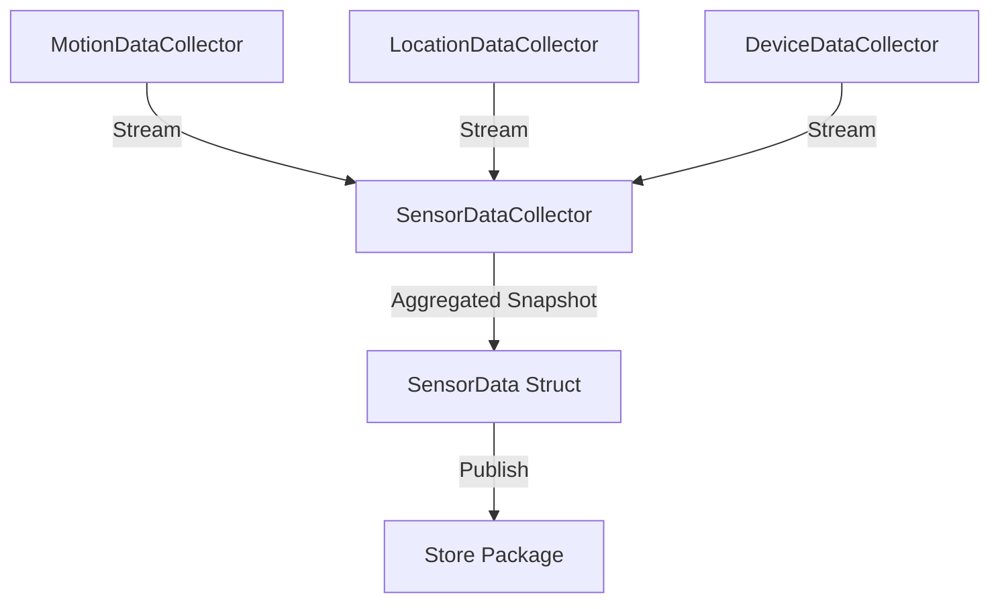

# DataCollector | The Nervous System

**Technical White Paper**
**Package Version: 1.0**

---

## 1. Executive Summary
**DataCollector** is the sensory interface of the Canvas framework. It is responsible for the continuous, energy-efficient acquisition of raw environmental and biometric data. Acting as the "Nervous System," it feeds the `Store` with high-fidelity snapshots of the user's physical reality.

## 2. Core Responsibilities
-   **Motion Sensing**: Detecting activity types (Walking, Running, Automotive) via `CoreMotion`.
-   **Location Tracking**: Capturing geospatial coordinates with adaptive accuracy via `CoreLocation`.
-   **Advanced Sensing**: Leveraging `SensorKit` for deep context (Keyboard Metrics, Speech Prosody, Ambient Light).
-   **Environmental Sensing**: Monitoring ambient light levels and barometric pressure.
-   **Device Telemetry**: Tracking battery level, screen brightness, and device usage patterns.

## 3. Architecture
The package uses a centralized coordinator pattern:

## 4. Key Components

### 4.1. SensorDataCollector
The main entry point. It orchestrates the sub-collectors and produces synchronized `SensorData` objects.
-   **Sampling Rate**: Adaptive (1Hz active, 0.1Hz passive).
-   **Battery Awareness**: Automatically throttles collection when battery < 20%.

### 4.2. MotionDataCollector
Wraps `CMMotionActivityManager` and `CMPedometer`.
-   **Activity**: Stationary, Walking, Running, Automotive, Cycling.
-   **Metrics**: Step count, Cadence, Pace.

### 4.3. LocationDataCollector
Wraps `CLLocationManager`.
-   **Privacy**: Uses "Significant Location Change" monitoring by default to save power and privacy.
-   **Precision**: Escalates to GPS only when "High Vibe" activity (e.g., Running) is detected.

### 4.4. SensorKitCollector (New)
Wraps `SRSensorReader` to ingest advanced privacy-preserving metrics.
-   **KeyboardMetrics**: Typing speed and error rates (Cognitive Load).
-   **TelephonySpeechMetrics**: Voice prosody and volume during calls (Emotional State).
-   **AmbientLightSensor**: Lux and Color Temperature (Circadian Rhythm).
-   **DeviceUsageReport**: App category usage (Focus vs. Distraction).
-   **MediaEvents**: Music and podcast playback context.

### 4.5. SensorData (The Atom)
The fundamental unit of information in Canvas. A struct containing:
-   Timestamp
-   Location (Lat/Lon/Alt)
-   Motion Activity
-   Battery Level
-   Ambient Light (Lux)
-   Device Usage Category

## 5. Privacy & Ethics
DataCollector is **read-only**. It never transmits data. All collection is subject to strict iOS permission gates (`NSLocationWhenInUseUsageDescription`, `NSMotionUsageDescription`).
